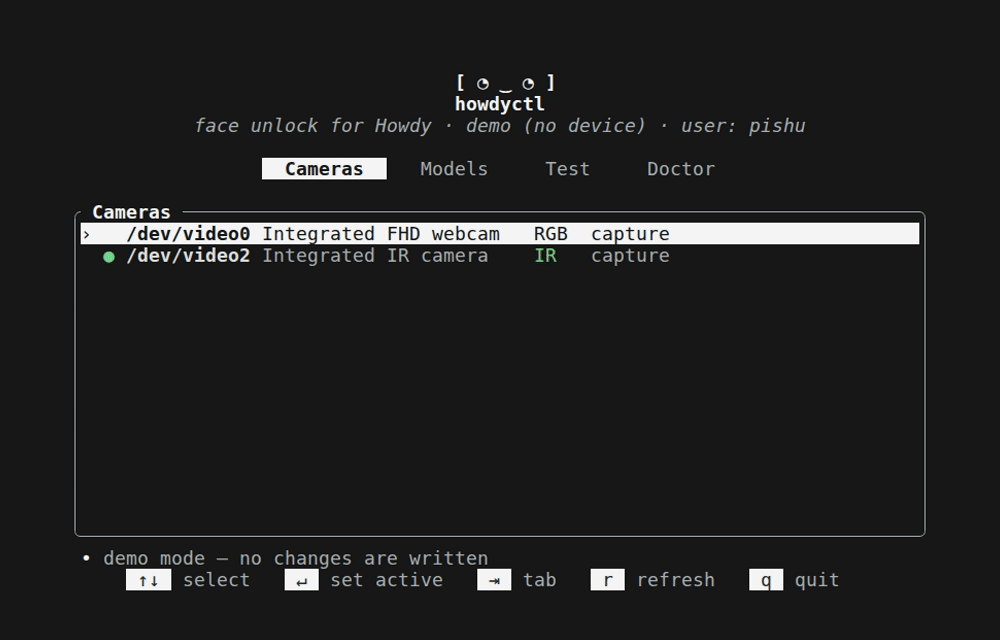

<div align="center">

# howdyctl

**A fast, refined TUI + CLI to manage [Howdy](https://github.com/boltgolt/howdy) face authentication on Linux.**

[](https://github.com/mrp2003/howdyctl/actions)
[](https://crates.io/crates/howdyctl)
[](#license)



</div>

> Manage Howdy face unlock from one keyboard-driven screen: pick the right camera,
> enroll and prune face models, **tune the match threshold by *watching* the distance**,
> and run a health check that knows the ways Howdy breaks on a modern distro.

`howdyctl` is the sibling of [`lampctl`](https://github.com/mrp2003/lampctl) — both
born on an **ASUS TUF** laptop where the hardware only works on Linux if you talk to it
directly. `lampctl` lit up a keyboard with no driver; `howdyctl` tames Howdy, whose
CLI-only workflow and sharp edges (a Python‑2 `pam.py` that silently falls back to a
password, directories PAM can't traverse, a certainty threshold you set blind) make
face unlock fiddlier than it should be. `howdyctl` puts all of that on one screen.

## Features

- 📷 **Cameras** — every `/dev/video*` device, labelled **IR vs RGB** and capture vs
  metadata (via a real v4l2 `QUERYCAP`), one keypress to make one active
- 🧑 **Models** — list, enroll and delete face models (reads the model file directly,
  so listing needs no root)
- 🎯 **Test & tune** — run a recognition check and see the **match distance against
  your threshold on a gauge**, so you stop guessing at `certainty`
- 🩺 **Doctor (with `--fix`)** — checks the exact things that silently break Howdy
  (dlib/OpenCV imports, model data files, a Python‑3‑safe `pam.py`, world-traversable
  directories, PAM wiring, the configured camera, enrolled models) — and `doctor --fix`
  repairs the fixable ones for you
- ⌨️ **TUI _and_ CLI** — a polished [ratatui](https://ratatui.rs) interface, plus
  `howdyctl test`, `howdyctl doctor`, `howdyctl set-camera /dev/video2`, … for scripts
- 🔐 **No sudo for the whole app** — it runs as you and elevates only the few root-only
  actions with `pkexec`

## Install

```sh
cargo install howdyctl
```

Or build and install from source (also handy for hacking):

```sh
git clone https://github.com/mrp2003/howdyctl && cd howdyctl
./install.sh            # builds release, installs to /usr/local/bin (uses sudo)
```

`howdyctl` manages an **existing** Howdy install — see
[boltgolt/howdy](https://github.com/boltgolt/howdy) to set Howdy up first. No udev
rule or group change is needed: `howdyctl` uses the camera access your login session
already has and elevates root-only actions (enroll, config edits) with `pkexec`.

## Usage

```sh
howdyctl                    # launch the TUI
howdyctl --demo             # TUI with fake data — no Howdy or camera needed
howdyctl doctor             # health-check the install
howdyctl doctor --fix       # auto-repair the fixable problems (pops a pkexec prompt)
howdyctl test               # one recognition attempt + match distance
howdyctl list               # detected cameras (IR/RGB, capture/metadata)
howdyctl models             # enrolled face models
howdyctl add "No glasses"   # enroll a model (pops a pkexec prompt)
howdyctl set-camera /dev/video2
howdyctl certainty 4.0      # set the match threshold (lower = stricter)
```

In the TUI: `Tab`/`←`/`→` switch tabs, `↑`/`↓` select, `q` quits; each tab shows its
own keys in the footer.

## How it works

`howdyctl` is a thin, honest layer over a normal Howdy install:

1. **Cameras** come from `/sys/class/video4linux`; IR-vs-RGB is read from the device
   name and capture capability from a `VIDIOC_QUERYCAP` ioctl.
2. **Models** are read straight out of Howdy's world-readable model JSON; enroll/remove
   shell out to Howdy's own CLI.
3. **Test** runs Howdy's `compare.py` and parses the result; with detailed reporting on,
   it shows the exact winning distance so you can set `certainty` with real margin.
4. **Config** edits rewrite `config.ini` line-by-line, preserving comments — the same
   approach Howdy's own installer uses.

Anything that writes Howdy's root-owned files is run via `pkexec`; everything else runs
as you.

## Project layout

| Crate | What it is |
|---|---|
| [`howdy`](crates/howdy)     | Library: cameras, config, models, recognition test, doctor |
| [`howdyctl`](crates/howdyctl) | Binary: the ratatui TUI + CLI |

## License

Dual-licensed under either [MIT](LICENSE-MIT) or [Apache-2.0](LICENSE-APACHE), at your option.
